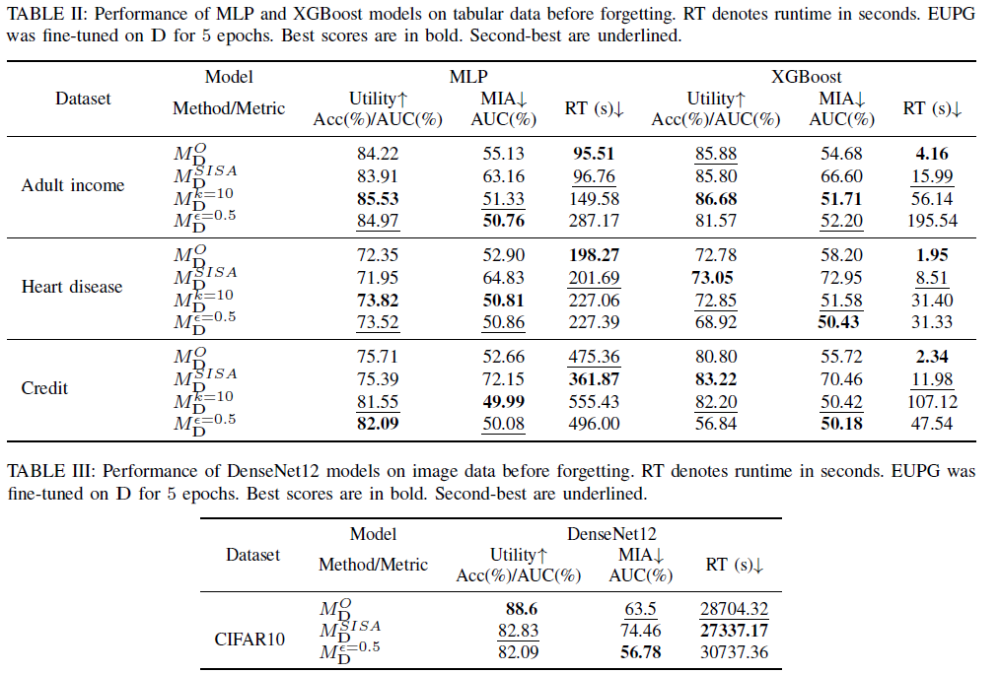
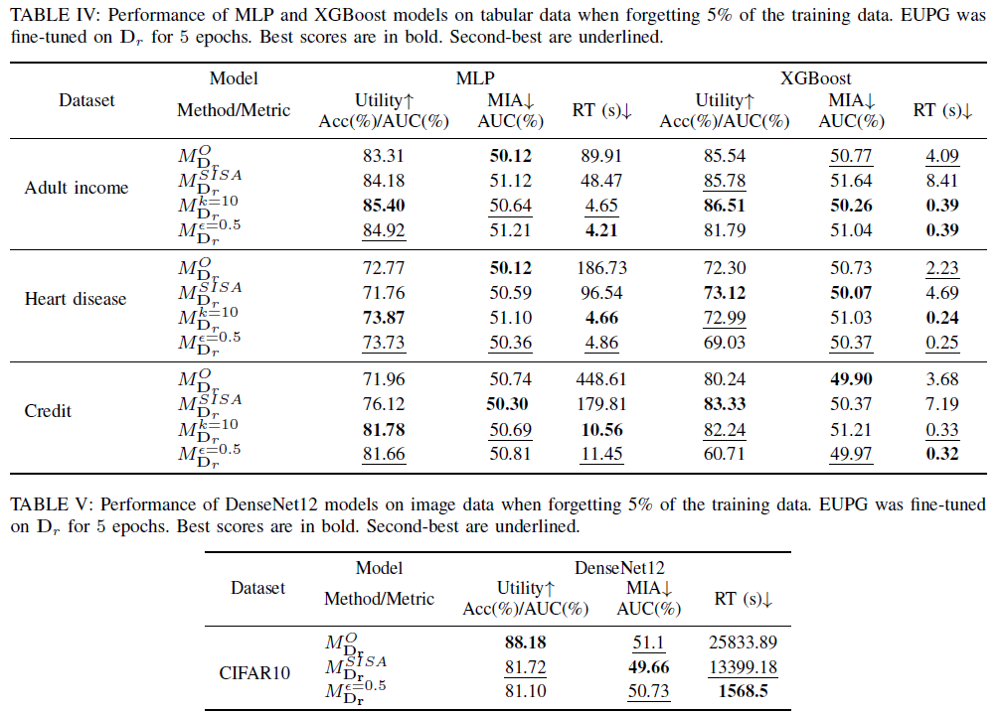

# EUPG: Efficient Unlearning with Privacy Guarantees

This is the official repository containing the code needed to replicate the results from "EUPG: Efficient Unlearning with Privacy Guarantees."

## Paper

[EUPG: Efficient Unlearning with Privacy Guarantees]()

## Usage

The repository includes a Jupyter notebook for each benchmark. These notebooks can be used to reproduce the experiments reported in the paper for their respective benchmarks.

## Datasets

The four datasets used are publicly available( the three tabular datasets are located in the data folder):
- [Adult Income](https://archive.ics.uci.edu/ml/datasets/Adult)
- [Heart Disease](https://www.kaggle.com/sulianova/cardiovascular-disease-dataset)
- [Credit Information](https://www.kaggle.com/c/GiveMeSomeCredit)
- [CIFAR10](https://www.cs.toronto.edu/~kriz/cifar.html) will automatically be downloaded from Torchvision datasets.

## Dependencies

- **Python**: 3.8.16
- **TensorFlow**: 2.13.0
- **Torch**: 1.12.0
- **Torchvision**: 0.13.0
- **NumPy**: 1.24.3
- **Pandas**: 1.5.3
- **SciPy**: 1.10.1
- **Scikit-learn**: 1.3.0
- **XGBoost**: 2.0.2

The required Anaconda environment can be installed using the `environment.yml` file.

## Main Results

### Before Unlearning

*The tables below show the performance of EUPG before forgetting.*  

### After Unlearning

*The tables below show the post-unlearning performance of EUPG after forgetting 5% of the training data.*  

## Citation

*Information to be added*

## Funding

*Information to be added*

