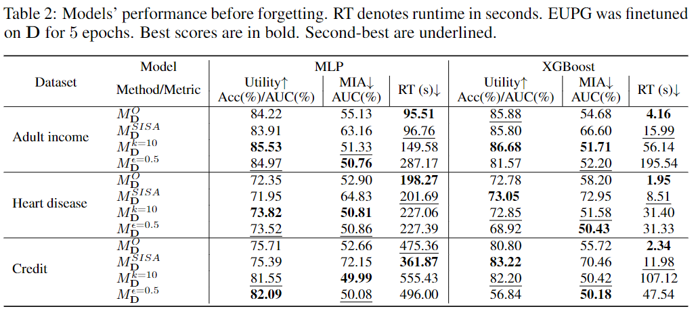
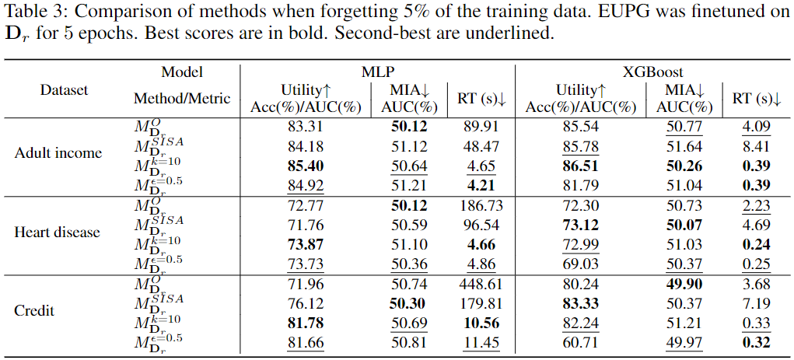

# EUPG: Efficient Unlearning with Privacy Guarantees
The official code to replicate the results found in ''EUPG: Efficient Unlearning with Privacy Guarantees''.

## Paper 

[EUPG: Efficient Unlearning with Privacy Guarantees]()

## Content
The repository contains one jupyter notebook for each benchmark which can be used to re-produce the experiments reported in the paper for that benchmark. The notebooks contain clear instructions on how to run the experiments. 

## Data sets
The three used datasets (found in the data folder) are publicly available.
[Adult income](https://archive.ics.uci.edu/ml/datasets/Adult), [Heart disease](https://www.kaggle.com/sulianova/cardiovascular-disease-dataset), and [Credit information](https://www.kaggle.com/c/GiveMeSomeCredit).

## Dependencies

- **Python**: 3.8.16
- **TensorFlow**: 2.13.0
- **Torch**: 1.12.0
- **Torchvision**: 0.13.0
- **NumPy**: 1.24.3
- **Pandas**: 1.5.3
- **SciPy**: 1.10.1
- **Scikit-learn**: 1.3.0
- **XGBoost**: 2.0.2

The used Anaconda environment can also be installed using the file ``environemnt.yml''.

## Main results

### Before unlearning

*The table below shows EUPG performance when before unlearning.*   

### After unlearning

*The table below shows pot-unlearning performance of EUPG when forgetting 5% of the training data.*   

## Citation 

## Funding

